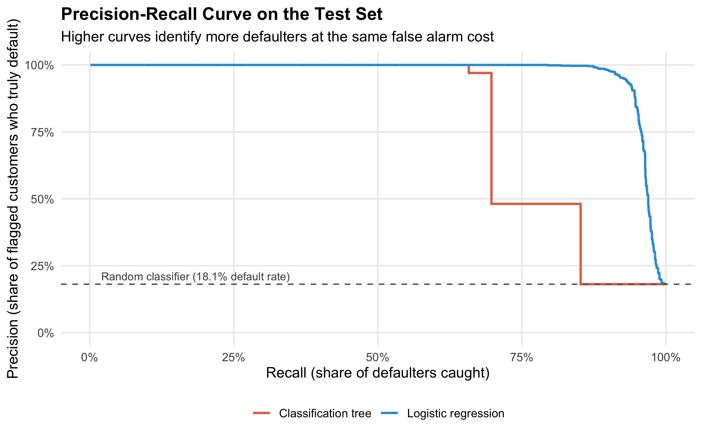

# Credit Risk & Default Prediction

## Overview

This project analyzes a loan portfolio dataset to understand which borrower characteristics are associated with credit default, and compares two classification models to decide which one should be used operationally.

The project started as an academic assignment for a data analytics course and was rewritten as a portfolio case study. The goal is not only to run a model, but to show a complete analytical workflow: exploratory analysis, model comparison, evaluation under class imbalance, interpretation, and business-oriented recommendations.

## Business Problem

Financial institutions need to estimate the probability that a borrower will default on a loan. Better default prediction can support risk management, loan approval policies, credit limits, pricing decisions, and customer monitoring.

This project asks:

- Which customer and loan variables are most associated with default?
- Can an interpretable model classify customers by default risk?
- What tradeoffs appear between correctly identifying risky borrowers and avoiding false alarms?

## Dataset

The dataset was provided by a professor for a university course. Because the data source and redistribution rights are not fully clear, the raw dataset is not included in this public repository.

To reproduce the analysis locally, place the dataset in:

```text
projects/credit-risk-default/data/raw/PROYECTO.xlsx
```

The original analysis expects a data frame with variables similar to:

- `Default`
- `IngresosCliente`
- `MontoPrestamo`
- `CreditoDisponible`
- `Edad`
- `NumeroDependientes`
- `Educacion`
- `EstadoCivil`
- `Genero`
- `RegionResidencia`
- `SectorEmpleo`

## Methods

The project uses:

- Exploratory data analysis
- Correlation analysis and grouped summaries
- Two competing models trained on identical predictors: a classification tree and a logistic regression
- Stratified evaluation on a held-out test set (70/30 split, fixed seed)
- Confusion matrix, sensitivity, specificity, precision, F1
- ROC-AUC and average precision
- Precision-recall analysis, appropriate for an imbalanced target
- Interpretation of decision rules and odds ratios

## Verified Results

The analysis was executed locally with the course dataset (`34,210` rows and `12` columns). Defaults are the minority class at `18.3%` of customers (`18.1%` in the test split), which drives how the models are evaluated.

Test-set metrics for both models:

| Metric | Classification tree | Logistic regression |
| --- | ---: | ---: |
| Accuracy | 0.941 | **0.978** |
| Sensitivity (recall on defaults) | 0.697 | **0.902** |
| Specificity | 0.995 | 0.995 |
| Precision | 0.970 | **0.978** |
| F1 score | 0.811 | **0.938** |
| ROC-AUC | 0.895 | **0.977** |
| Average precision | 0.797 | **0.968** |

**Accuracy is the wrong metric here.** Because only 18.3% of customers default, a model that approves everyone would already score 81.7% accuracy while catching zero defaulters. The decisive metrics are sensitivity, which measures how many real defaulters the model catches, and average precision, which summarises performance across every possible cutoff.

On those metrics the gap is decisive. At the same 0.5 cutoff and effectively identical specificity, the tree misses `563` defaulters out of `1,859` while the logistic regression misses `183`. In a portfolio of this size that is 380 risky borrowers who would have been approved without review.



The shape of the curves explains why. The tree produces only a handful of distinct probability values, one per leaf, so its curve collapses in steps and it cannot rank customers finely enough to trade recall against precision. The logistic regression yields a continuous score, which lets the business move the cutoff to match its risk appetite instead of accepting whatever the tree happens to output.

**Recommendation:** use the logistic regression as the scoring model and keep the tree as a communication tool, since its rules are readable for a credit committee that needs to justify a rejection.

### Honest caveats

- The data comes from a university exercise and behaves more cleanly than a real loan book. Three financial variables (`MontoPrestamo`, `IngresosCliente`, `CreditoDisponible`) each reach an AUC near `0.85` on their own, and combined they separate the classes almost perfectly. Metrics this high should not be read as the performance to expect in production.
- That near-separation makes `glm` report fitted probabilities of 0 or 1. Predictions remain usable and were validated on held-out data, but the individual coefficients are inflated and their magnitudes should not be interpreted as stable effect sizes.
- Both models are evaluated at a fixed 0.5 cutoff. A production deployment would set that threshold from the relative cost of a missed default versus a rejected good customer, which this dataset does not provide.

## How to Run

From the repository root:

```bash
Rscript projects/credit-risk-default/notebooks/credit_risk_default_analysis.R
```

The script creates:

- `figures/default_rate_distribution.png`
- `figures/loan_amount_vs_income.png`
- `figures/loan_amount_by_default.png`
- `figures/classification_tree.png`
- `figures/precision_recall_curve.png`
- `reports/model_metrics.csv`

Both models, all metrics, and both figures come from a single run of that script. The seed is fixed, so the numbers in this README are reproducible.

## Key Takeaways

- With an imbalanced target, a high accuracy figure can hide a model that misses a third of the cases that matter. Reporting sensitivity and average precision alongside it is what makes the evaluation honest.
- The simpler model won. Logistic regression beat the classification tree on every metric that matters here, which is a reminder that model complexity is not what drives performance.
- A model that outputs a continuous score is more useful to a business than one that outputs a handful of buckets, because the cutoff becomes a business decision rather than an artifact of the algorithm.
- Interpretability and accuracy were not in conflict in this case: the recommended model is also the one a risk team can explain to a regulator.

## Espanol

Este proyecto analiza una base de prestamos para estudiar que caracteristicas de clientes y creditos se asocian con el default. Convierte una entrega universitaria en un caso de portfolio: problema, datos, analisis, comparacion de modelos, evaluacion e interpretacion.

Se comparan dos modelos entrenados con las mismas variables: un arbol de clasificacion y una regresion logistica. La regresion logistica es mejor en todas las metricas relevantes (sensibilidad 0.902 contra 0.697, average precision 0.968 contra 0.797) y es la que se recomienda para uso operativo. El arbol se conserva porque sus reglas son faciles de explicar.

Como solo el 18.3% de los clientes cae en default, el accuracy no es la metrica de decision: un modelo que aprueba a todos ya alcanzaria 81.7% sin detectar un solo caso de riesgo. Por eso el analisis se apoya en sensibilidad, average precision y la curva precision-recall.

Los datos provienen de un ejercicio academico y se comportan de forma mas limpia que una cartera real, asi que estas metricas no deben leerse como rendimiento esperable en produccion. La base no se sube a GitHub porque fue provista para una materia y no estan confirmados los permisos de redistribucion.
